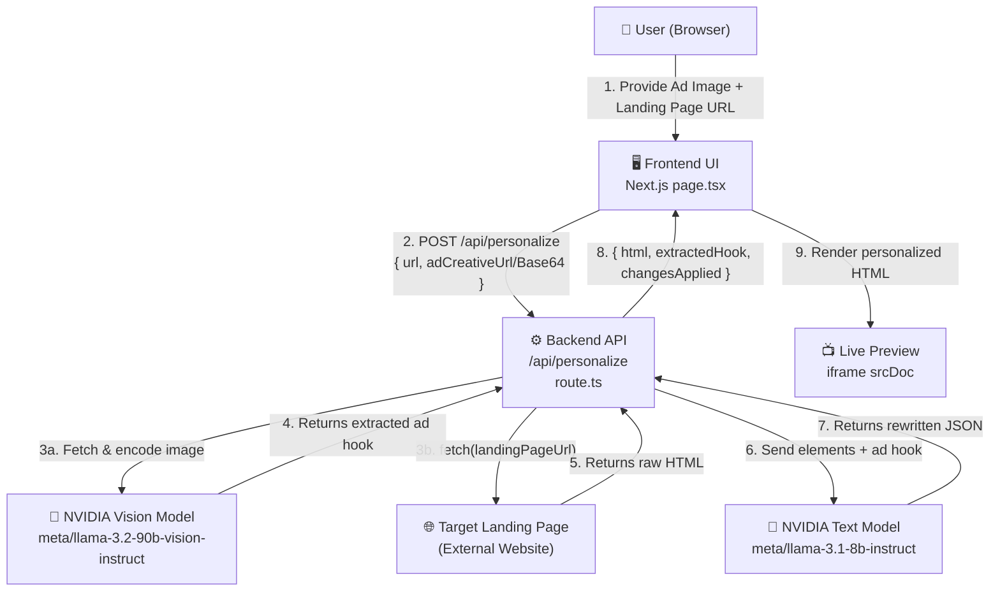
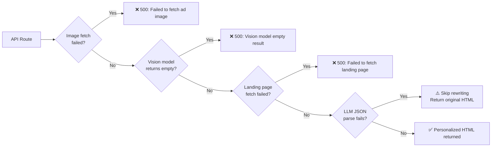

# AI Ad Match — System Workflow

> End-to-end flow of the AI-driven landing page personalization engine.

---

## High-Level Architecture

---

## Detailed Step-by-Step Pipeline

```mermaid
flowchart TD
    A([Start: User Submits Form]) --> B{Ad Input Mode?}

    B -->|Link| C["Receive image URL\nadCreativeUrl"]
    B -->|Upload| D["Receive base64\nadCreativeBase64\n(FileReader → DataURL)"]

    C --> E["urlToBase64()\nFetch image server-side\n→ convert to data:image/... URI"]
    D --> F["Use base64 directly\n(already a DataURL)"]

    E --> G["Step 1: Image Data URI ready"]
    F --> G

    G --> H["Step 2: extractAdHook()\nPOST to NVIDIA NIM\nllama-3.2-90b-vision-instruct\ntemp=0.1, max_tokens=300"]

    H --> I["✅ adCopy (ad hook text extracted)"]

    I --> J["Step 3: fetch(landingPageUrl)\nWith browser-like User-Agent headers"]

    J --> K{HTTP OK?}
    K -->|No| ERR1["❌ Return 500\nFailed to fetch landing page"]
    K -->|Yes| L["Step 4: Parse HTML\ncheerio.load(html)"]

    L --> M["Fix Asset URLs\nresolveUrls()\n• img src / srcset / data-src\n• link href (CSS)\n• inline background-image\n• video/audio src & poster\n• favicon"]

    M --> N["Make Static\n• Remove script tags\n• Unwrap noscript tags\n• Disable form onsubmit\n• Inject base tag → origin/"]

    N --> O["Step 5: Extract Text Elements\nTag targets: title, h1–h4\nShort paragraphs 15–150 chars\nCTA buttons/links 2–40 chars\n(keywords: get/start/try/sign/free...)"]

    O --> P["Assign data-pe-id markers\npe-1, pe-2 ... pe-N\nCap at 20 elements"]

    P --> Q{Any elements\nfound?}
    Q -->|No| R["Return plain static HTML\n(no personalization applied)"]
    Q -->|Yes| S["Step 6: Rewrite with LLM\nPOST to NVIDIA NIM\nllama-3.1-8b-instruct\ntemp=0.3, max_tokens=2048"]

    S --> T["CRO System Prompt:\n1. Continuity\n2. Subtlety\n3. Specificity\n4. Preserve Structure\n5. CTA Alignment\n6. No Hallucination"]

    T --> U["User Prompt:\nAD HOOK + JSON of elements\n→ Return JSON with same IDs\n   and rewritten text"]

    U --> V["Parse LLM JSON Output\nStrip markdown fences\nJSON.parse()"]

    V --> W["Step 7: Inject Rewritten Text\n$('[data-pe-id=id]').text(newText)\nRemove all data-pe-id markers\nDisable all href links"]

    W --> X["Prepend Info Banner\n'AI Personalized — Ad Hook: ...'\nN element(s) rewritten"]

    X --> Y["Return JSON Response\n{ html, extractedHook,\n  changesApplied, totalElements }"]

    Y --> Z["Frontend: setHtmlContent(data.html)\nRender in iframe with srcDoc"]

    Z --> AA([End: User Sees Personalized Preview])
```

---

## Data Structures

### Request Payload (`POST /api/personalize`)

| Field | Type | When Present |
|---|---|---|
| `url` | `string` | Always (landing page URL) |
| `adCreativeUrl` | `string` | Link mode |
| `adCreativeBase64` | `string` | Upload mode (DataURL) |

### Response Payload

| Field | Type | Description |
|---|---|---|
| `html` | `string` | Full personalized static HTML |
| `extractedHook` | `string` | Ad copy extracted by vision model |
| `changesApplied` | `number` | Count of elements successfully rewritten |
| `totalElements` | `number` | Total elements extracted for rewriting |
| `message` | `string` | Status message |

---

## AI Model Details

| Role | Model | Params | Purpose |
|---|---|---|---|
| Vision | `meta/llama-3.2-90b-vision-instruct` | temp=0.1, max_tokens=300 | Extract ad hook from image |
| Text / CRO | `meta/llama-3.1-8b-instruct` | temp=0.3, max_tokens=2048 | Rewrite page copy for message match |
| Gateway | NVIDIA API Catalog (NIM) | `integrate.api.nvidia.com/v1` | OpenAI-compatible API endpoint |

---

## Error Handling Paths

---

## Technology Layer Map

| Layer | Technology | Role |
|---|---|---|
| **Framework** | Next.js 16 (App Router) | Full-stack React — SSR + API routes |
| **Language** | TypeScript | Type safety across full stack |
| **Styling** | Tailwind CSS | UI design tokens |
| **HTML Parsing** | Cheerio | Server-side DOM manipulation (no Chrome) |
| **HTTP Client** | Native `fetch` (Node.js) | Fetch ad images + landing pages |
| **AI Gateway** | NVIDIA NIM via OpenAI SDK | Model hosting, OpenAI-compatible |
| **Vision AI** | Llama 3.2 90B Vision | Extract ad hook from image |
| **Text AI** | Llama 3.1 8B Instruct | CRO-focused copy rewriting |
| **Preview** | `<iframe srcDoc>` | Sandboxed static HTML rendering |
